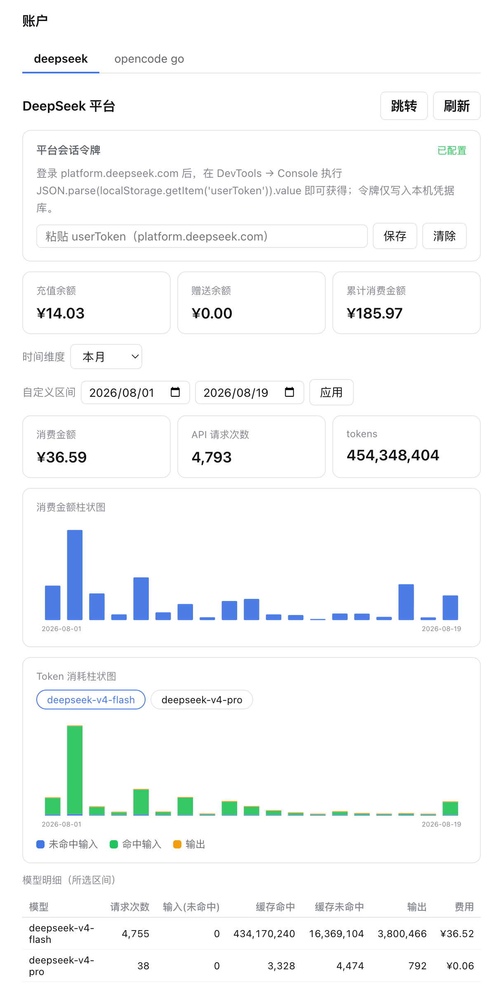
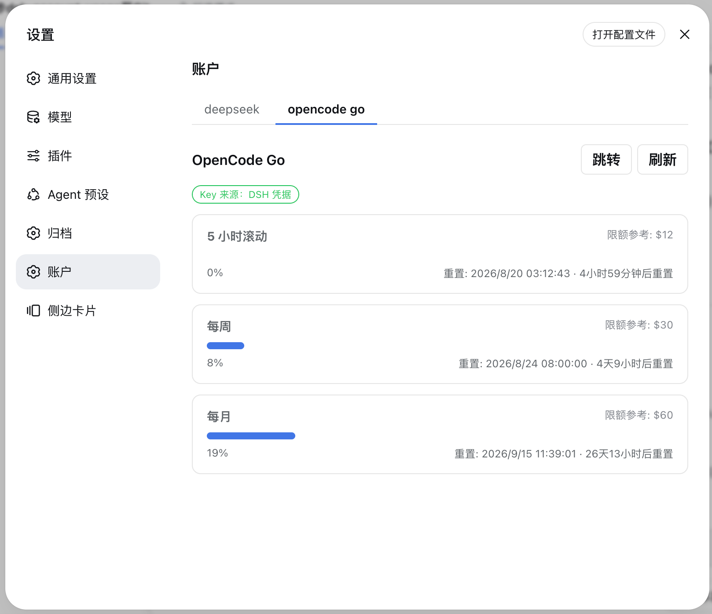

# dsh-account-usage

[](README.md)
[](README_en.md)

<div align="center">

DeepSeek Harness（DSH）网页界面插件：在设置面板新增「账户」页，一站式查看 DeepSeek 平台余额/用量与 OpenCode Go 配额。

[](LICENSE)
[](package.json)
[](https://github.com/deepseek-ai/deepseek-harness)

</div>

---

## 📑 目录

- [📸 界面预览](#-界面预览)
- [✨ 功能特性](#-功能特性)
- [🚀 快速开始](#-快速开始)
- [⚙️ 配置说明](#️-配置说明)
- [📖 使用说明](#-使用说明)
- [🔧 工作原理](#-工作原理)
- [🧰 环境变量](#-环境变量)
- [⚠️ 已知限制](#️-已知限制)
- [🛠️ 开发](#️-开发)
- [🤝 贡献](#-贡献)
- [📄 许可证](#-许可证)

---

## 📸 界面预览

**DeepSeek 平台内容**（默认嵌入官方「账号与余额」页底部；旧截图为独立兜底页布局）：余额概览、时间维度与自定义区间、每日消费/Token 柱状图、网页搜索/抓取用量图表、按模型明细表。



**OpenCode Go 配额页**：5 小时滚动 / 每周 / 每月三个窗口的用量进度条、重置时间与限额参考。



---

## ✨ 功能特性

| 功能 | 说明 |
|------|------|
| **DeepSeek 平台概览** | 充值余额、赠送余额、累计消费金额、本月消费金额、本月 Tokens |
| **每日柱状图** | 消费金额与 Token 消耗双图表，SVG 渲染，鼠标悬停查看每日明细 |
| **网页搜索 / 抓取用量** | 按日展示 tool-search / tool-fetch 的调用次数、调用类型费用与分工具面积图，随所选时间维度联动；超过 31 天自动分段查询 |
| **合并至官方账号与余额页** | 官方账户页存在时，插件内容嵌入其原生卡片下方，不再占用独立导航项；切分区时隐藏、切回恢复 |
| **账户菜单余额入口** | 在账户菜单「设置」上方显示「余额：¥x.xx」（充值余额 + 赠送余额），点击打开官方「账号与余额」页；官方页不可用时回退到兜底页 |
| **时间维度切换** | 今天 / 近 7 天 / 近 30 天 / 近 90 天 / 本月 / 上月 / 自定义区间 |
| **按模型明细表** | deepseek-v4-flash / deepseek-v4-pro / 其他：请求次数、输入/缓存/输出 Tokens、费用 |
| **OpenCode Go 配额** | 5 小时滚动 / 每周 / 每月三个窗口的用量百分比与下次重置时间 |
| **自动刷新** | 页面挂载期间每 60 秒自动轮询最新数据 |
| **双语言界面** | 完整的中英文切换支持 |
| **兜底独立账户页** | 未登录 DSH 官方账号或旧版没有官方账户页时，自动注册插件独立「账户」分区，保证令牌与用量仍可访问 |

> [!NOTE]
> `0.3.0` 将插件内容合并进官方「账号与余额」页：官方账户页存在时不再显示独立「账户」导航项，内容显示在官方原生卡片下方；嵌入模式保留完整的「充值余额 / 赠送余额 / 累计消费金额」展示，与官方余额卡并列（两者刷新时间可能略有差异）。账户菜单余额入口改为打开官方「账号与余额」页。未登录/旧版无官方页时仍保留独立兜底页。升级后需完全退出并重开 DSH 桌面端。

> `0.2.1` 修正与 DSH 0.2.2-rc.1 相关的两处兼容问题：① 去掉对 `@deepseek-ai/dsh-credentials` 的内置依赖——本插件只用该包的一个纯函数（凭证引用名语法校验），内联后插件目录不再携带第二份 `@deepseek-ai/cordis`，消除双实例隐患；② 设置导航图标改走官方 `settings.section.icon` 插槽，旧壳继续由 DOM 钩子兜底（两者靠 svg 标记互斥，不会重影）。同时补上 `engines.dsh: >=0.2.1-rc.2`，让 DSH 的插件兼容性门禁对本事生效。

> `0.2.0` 新增网页搜索/抓取用量图表与账户菜单余额入口。余额入口适配 DSH 桌面端 `0.2.1-rc.5` 的原生账户菜单结构：旧版本没有该菜单、或上游重做菜单时入口会静默不显示，不影响「账户」页。分工具用量接口单次最多 31 天，插件会自动分段合并。升级后需完全退出并重开 DSH 桌面端。

---

## 🚀 快速开始

### 前提条件

- 已安装 DSH CLI 与 pnpm（`dsh plugin` 内部转发到 pnpm）

### 安装

```sh
# 方式一：从本地源码安装（开发）
dsh plugin --profile web add <absolute-path-to-plugin>

# 方式二：从 GitHub 安装
dsh plugin --profile web add github:Ycet/dsh-account-usage
```

包声明了 `dsh.bundle` 补丁层，`dsh plugin` 会自动把加载项合入 profile 的 bundle 层，无需手动编辑 `cordis.patch.yml`。

<details>
<summary>手动合并补丁层（可选）</summary>

```yaml
# ~/.dsh/profiles/web/cordis.patch.yml
- insert:
    - id: account-usage
      name: dsh-account-usage
```
</details>

### 启动

1. 重启网页应用：`dsh web`
2. 打开 http://127.0.0.1:3080 并刷新页面
3. 登录 DSH 官方账号后打开「设置 → 账号与余额」，插件内容显示在官方卡片下方；未登录时设置面板出现插件兜底「账户」页

---

## ⚙️ 配置说明

### DeepSeek 平台令牌（必需，仅影响 DeepSeek 面板）

用量接口是平台控制台的私有接口，需要你的平台登录令牌：

1. 登录 https://platform.deepseek.com
2. 打开 DevTools → Console，执行：

   ```js
   JSON.parse(localStorage.getItem('userToken')).value
   ```

3. 在插件「账户」页的令牌输入框直接粘贴并保存（写入 `~/.dsh/.credentials.yaml` 的 `DEEPSEEK_PLATFORM_TOKEN`）

<details>
<summary>手动写入凭据文件（可选）</summary>

```yaml
# ~/.dsh/.credentials.yaml
DEEPSEEK_PLATFORM_TOKEN: <令牌>
```
</details>

令牌只存储在本机凭据库，浏览器与网络请求均不携带它往返上游以外的任何位置。

### OpenCode Go Key（通常无需配置）

插件按以下顺序自动查找：

1. DSH 凭据 `OPENCODE_GO_API_KEY`（`~/.dsh/.credentials.yaml`，在「设置 → 模型」配置 opencode-go 时通常已存在）；
2. OpenCode 自身的 `~/.local/share/opencode/auth.json`（`opencode-go` 条目，type 为 `api`）。

---

## 📖 使用说明

- 在设置面板打开「账号与余额」页，插件内容显示在官方身份/余额卡下方；未登录时则打开插件独立「账户」页；
- 在插件内容顶部切换 **deepseek / opencode go** 两个标签查看对应数据；
- DeepSeek 页可切换时间维度（今天 / 近 7 天 / 近 30 天 / 近 90 天 / 本月 / 上月），或选择「自定义区间」后点击「应用」；
- 柱状图支持鼠标悬停查看每日明细；模型明细表展示所选区间内各模型的请求次数、Tokens 与费用；
- 「网页搜索与抓取」模块展示所选区间内 tool-search / tool-fetch 的调用次数、调用类型费用与每日面积图；超过 31 天的区间会自动分段查询后合并；
- 账户菜单（侧栏账户头像菜单）中「设置」上方新增「余额：¥x.xx」入口，数值为充值余额 + 赠送余额，点击后打开设置并定位到官方「账号与余额」页（无官方页时定位到插件兜底页）；
- OpenCode Go 页展示三个配额窗口的用量百分比、下次重置时间与限额参考，可一键「跳转」到 opencode.ai 或「刷新」；
- 页面挂载期间每 60 秒自动刷新；「打开配置文件」按钮可直接定位本机 DSH 凭据文件。

---

## 🔧 工作原理

双面插件（宿主 + 浏览器），数据通道为宿主注册的同源 HTTP 路由：

| 部分 | 文件 | 作用 |
|------|------|------|
| 宿主 | `index.js` | 注册三条 `GET /api/account-usage/*` 精确路由（`deepseek-summary` / `deepseek-usage` / `opencode`）；经 `ctx.credentials` 解析密钥，固定白名单上游 URL，15s 超时 + 30s 缓存；`deepseek-usage` 同时合并模型用量与网页搜索/抓取用量 |
| 解析聚合 | `lib/aggregate.js` | 纯函数：平台信封解包后的每日/每模型 token、费用、请求次数聚合；网页搜索/抓取的时间窗口切分、函数用量与费用合并 |
| 浏览器 | `client.js` | 手写惰性 CJS 客户端包：官方账户页存在时用 `react-dom/client` 把内容根挂到官方 `settings.section` 的 `<section>` 末尾（切分区摘除 DOM、保留根；关闭设置卸载）；官方页不可用时注册兜底 `settings.section`（id `account-usage`）。同时负责 SVG 图表、60s 刷新、设置导航图标与账户菜单余额入口 |
| 组合 | `cordis.patch.yml` | `dsh.bundle` 补丁层，安装时自动合入 |

### 数据源

| 用途 | 端点 | 认证 |
|------|------|------|
| 账户概要 | `platform.deepseek.com/api/v0/users/get_user_summary`（+`/get_user_info`） | `Bearer <userToken>` |
| 每日 token 明细 | `platform.deepseek.com/api/v0/usage/amount?month=&year=` | `Bearer <userToken>` |
| 每日费用明细 | `platform.deepseek.com/api/v0/usage/cost?month=&year=` | `Bearer <userToken>` |
| 网页搜索/抓取调用次数 | `platform.deepseek.com/api/v0/usage/by_api_key/amount?start=&end=&tz=`（≤31 天/次） | `Bearer <userToken>` |
| 网页搜索/抓取费用 | `platform.deepseek.com/api/v0/usage/by_api_key/cost?start=&end=&tz=`（≤31 天/次） | `Bearer <userToken>` |
| OpenCode Go 配额 | `opencode.ai/zen/go/v1/usage`（官方） | `Bearer <sk-opencode-…>` |

---

## 🧰 环境变量

| 变量 | 默认 | 说明 |
|------|------|------|
| `DSH_ACCOUNT_USAGE_TIMEOUT_MS` | `15000` | 上游请求超时（毫秒） |
| `DSH_ACCOUNT_USAGE_CACHE_MS` | `30000` | 平台数据缓存 TTL（毫秒） |
| `DSH_ACCOUNT_USAGE_MAX_MONTHS` | `3` | 单次查询可覆盖的最大月份数（超出自动裁剪） |
| `DSH_ACCOUNT_USAGE_OPENCODE_CACHE_MS` | `60000` | OpenCode 配额缓存 TTL（毫秒） |

---

## ⚠️ 已知限制

- DeepSeek 平台用量接口为**未公开的私有接口**，字段可能随平台升级变化；插件对响应做防御式解析，字段缺失时降级为「—」而非报错。若页面长期显示「—」，请重新抓包确认字段并反馈。
- 「累计消费金额」「API 请求次数」字段不在公开文档中：累计消费按命名启发式在概要响应中搜索（找不到则显示「—」），请求次数读取模型条目上的 `count/requests/request_count/req_count/calls` 字段。两者均在真实令牌实测后校准。
- 网页搜索/抓取用量接口单次最多查询 31 天；插件按 31 天窗口自动分段，区间过长时请求数会相应增加。工具名来自平台返回的 `functions` 数组（当前为 `tool-search` / `tool-fetch`），未知工具原样展示。
- 账户菜单余额入口依赖 DSH 0.2.x 的原生账户菜单 DOM；上游重做菜单结构时入口可能暂时不显示，但不影响账户页与其余功能。该入口只读取本插件已配置的平台令牌，不会额外保存余额数据。
- 合并内容依赖官方「账号与余额」页的 DOM（`[data-slot="settings.section"]` 内的 `<section>`）；上游重写账户页结构时嵌入内容可能不再显示，此时可等待插件适配或暂时依赖兜底页（官方页存在时兜底页不会显示）。
- 嵌入内容在同一设置会话内切换分区会保留 tab/时间维度；关闭设置再打开会重置为 deepseek / 本月。官方页仅登录 DSH 官方账号后存在，未登录时使用兜底页。
- OpenCode Go 的限额（$12/$30/$60）为套餐参考值，端点未返回限额；套餐调整时以 opencode.ai 页面为准。
- 服务绑定 `0.0.0.0` 时本插件路由对局域网可达（与 DSH 其他本地插件相同的既有限制，默认 `127.0.0.1` 无此问题）。

---

## 🛠️ 开发

```sh
npm run check  # 宿主、客户端和聚合模块语法检查
npm test       # 凭据、OpenCode Go、工具用量解析与路由回归测试

# 本地安装（开发迭代）：
dsh plugin --profile web add <absolute-path-to-plugin>
# 修改源码后需重新安装（先 remove 再 add，或提升版本号后重新 add），再重启 dsh web
```

修改 `client.js` 后需重启 `dsh web`（重新生成 boot-graph 哈希），再强制刷新页面。

桌面端需完全退出并重新打开应用。本地 `link:` 安装会直接加载修改后的源码。设置 `DSH_TEST_INSTALL_ROOT` 为包含 DSH `node_modules` 的运行时目录后，`npm test` 还会使用真实槽位注册器验证官方页与插件页的两种加载顺序，以及卸载插件页后官方页仍保留；未设置时跳过这两项集成测试。

> [!NOTE]
> `dsh plugin` 在 Windows 下经 shell 转发 pnpm，安装路径不能含空格；工作区路径含空格时可先在无空格路径建目录联接（`mklink /J`）作为安装网关。

---

## 🤝 贡献

欢迎提交 Issue 与 Pull Request：发现问题请携带界面截图与版本号到 [Issues](https://github.com/Ycet/dsh-account-usage/issues) 反馈；改进请按 Fork → 分支 → PR 流程提交。

---

## 📄 许可证

本项目使用 [MIT](LICENSE) 许可证。
